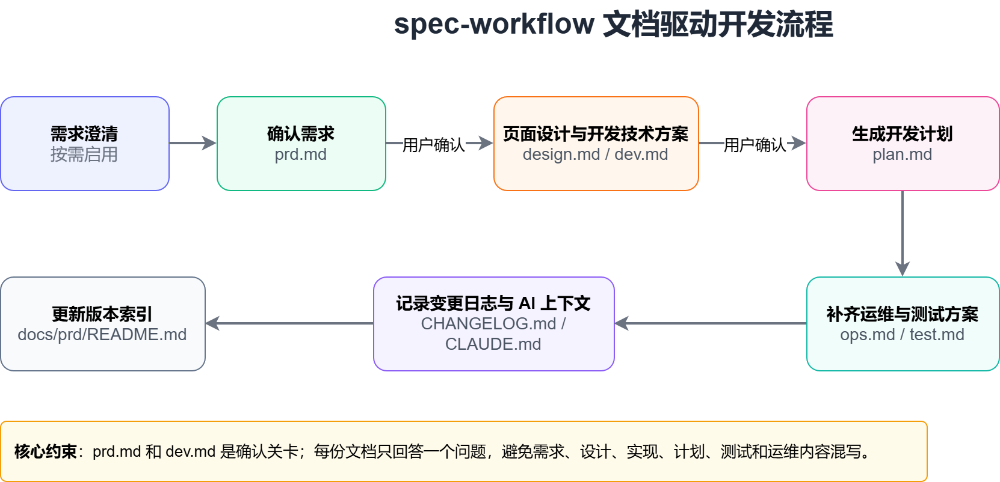

# Spec-workflow v3.0.0

> 一个面向 AI 协作开发的文档驱动工作流 Skill，通过结构化、版本化的项目文档，将需求、设计、实现、测试、运维和迭代过程串联起来，为 AI Coding 提供稳定上下文，提升开发的准确性、可控性与可追溯性。

在 AI Coding 中，真正影响交付质量的往往不是模型是否会写代码，而是需求是否清晰、边界是否明确、技术方案是否可执行、验证标准是否完整。`spec-workflow` 通过文档先行，把模糊想法沉淀为可确认、可追踪、可迭代的开发上下文，让 AI 沿着明确规格参与完整开发流程。

**当前版本**：v3.0.0

## 工作流总览

`spec-workflow` 默认按文档驱动开发流程推进：




其中：

- 需求不完整、边界模糊，或用户要求“拷问 / grill me / 压测方案”时，先一问一答澄清需求，每个问题给出推荐答案
- `prd.md` 生成后需要用户确认，再进入设计和技术文档阶段
- `dev.md` 生成后需要再次确认，再输出开发计划
- `plan.md` 只负责排期、任务、风险，不重复技术实现内容
- `ops.md` 和 `test.md` 在开发阶段同步完善，确保可部署、可测试
- `CHANGELOG.md` 和 `CLAUDE.md` 作为项目记忆体，随项目演进持续更新

## 能力范围

- **生成模式**：从零产出完整项目文档链路，覆盖 `prd.md`、`design.md`、`dev.md`、`plan.md`、`ops.md`、`test.md`、`CHANGELOG.md`、`CLAUDE.md`
- **需求澄清**：当需求不完整或用户要求“grill me / 拷问方案”时，先逐项追问并给出推荐答案，再生成 PRD
- **管理模式**：维护已有 `docs/prd/<version>/` 文档，支持查看、扩展、对比、搜索、归档
- **迭代模式**：支持语义化版本管理（major.minor.patch），自动识别变更类型并更新版本号
- **测试驱动**：强制要求代码变更必须同步更新测试，支持 PRD ↔ Code 双向验证
- **运维支持**：提供完整的部署、监控、故障排查、回滚流程文档
- **事故记录**：提供事故记录模板，沉淀经验、防止重复发生
- **索引维护**：同步更新 `docs/prd/README.md`，保持版本摘要倒序展示

## 安装方式

### macOS / Linux

如果你通过 Skill 目录安装，可参考：

```bash
git clone https://github.com/Monivoo/spec-workflow ~/.claude/skills/spec-workflow
```

### Windows

在 Windows 上，可克隆到当前用户的 Claude Skills 目录：

```powershell
git clone https://github.com/Monivoo/spec-workflow $env:USERPROFILE\.claude\skills\spec-workflow
```

也可以使用 CMD：

```cmd
git clone https://github.com/Monivoo/spec-workflow %USERPROFILE%\.claude\skills\spec-workflow
```

### 手动复制

如果你已经拿到了 `spec-workflow` 文件夹，也可以直接将整个文件夹复制到 Claude Skills 目录下：

```text
~/.claude/skills/spec-workflow
```

Windows 对应路径通常为：

```text
%USERPROFILE%\.claude\skills\spec-workflow
```

## 适用场景

- **从零建文档**：为新项目或新版本初始化完整 PRD 文档链路（8 种文档类型）
- **增量补需求**：在已有版本中新增需求，并同步补充设计、计划或技术文档
- **版本治理**：查看版本状态、维护摘要索引、归档旧版本
- **版本对比**：对比不同版本之间的需求、优先级和计划变化
- **跨版本检索**：按主题搜索历史需求，如认证、支付、通知
- **前后端协作**：让 `prd.md`、`design.md`、`plan.md`、`dev.md` 各自聚焦单一职责
- **测试驱动开发**：强制要求代码变更必须同步更新测试，支持 PRD ↔ Code 双向验证
- **运维自动化**：提供完整的部署、监控、故障排查、回滚流程文档
- **事故复盘**：提供事故记录模板，沉淀经验、防止重复发生
- **AI 协作**：通过 CLAUDE.md 为 AI 助手提供项目上下文，提升协作效率

## 文档职责边界

| 文档 | 关注点 |
|------|--------|
| `prd.md` | 做什么、为什么：功能需求、用户故事、验收标准、业务目标 |
| `design.md` | 长什么样：页面结构、交互流程、组件清单、ASCII 原型 |
| `dev.md` | 如何实现：技术架构、数据模型、接口影响、文件变更 |
| `plan.md` | 何时做、谁来做：任务拆解、时间线、里程碑、风险 |
| `ops.md` | 如何部署和运维：环境变量、部署流程、监控告警、故障排查、回滚 |
| `test.md` | 如何测试和验证：测试策略、用例设计、自动化测试、验收标准 |
| `CHANGELOG.md` | 版本历史：变更记录、迁移指南、破坏性变更 |
| `CLAUDE.md` | AI 协作：项目上下文、技术栈、开发规范、关键决策、给 AI 的元规则 |

该 Skill 强调文档边界明确：

- 不把技术方案写进 `prd.md`
- 不把用户故事写进 `dev.md`
- 不把数据模型和接口定义写进 `plan.md`
- 不把部署流程写进 `dev.md`
- 不把测试用例写进 `prd.md`

这也是该 Skill 最重要的约束：**每份文档只回答一个问题**。

## 项目类型适配

- **前端项目**：`design.md` 为必含文档，重点描述页面结构、交互和组件设计
- **后端项目**：`dev.md` 为核心文档，需包含接口影响清单
- **涉及数据库变更**：应额外输出独立 SQL 文件，如 `sql/DDL.sql` 与 `sql/DML_init.sql`
- **生产环境项目**：`ops.md` 和 `test.md` 为必含文档，确保可部署、可测试、可监控
- **团队协作项目**：`CLAUDE.md` 为必含文档，为 AI 助手提供项目上下文，提升协作效率

## 版本管理策略

### 语义化版本规则

- **主版本号（Major）**：不兼容的 API 变更、架构重构、破坏性变更
- **次版本号（Minor）**：向下兼容的功能新增、模块扩展
- **修订号（Patch）**：向下兼容的问题修复、性能优化、文档更新

### 迭代触发条件

| 变更类型 | 版本号变化 | 示例 |
|---------|-----------|------|
| 破坏性变更 | Major + 1 | v1.0.0 → v2.0.0 |
| 新增功能模块 | Minor + 1 | v1.0.0 → v1.1.0 |
| Bug 修复 | Patch + 1 | v1.0.0 → v1.0.1 |

### 目录结构支持

支持两种目录结构模式：

#### 模式 A：版本优先（推荐用于快速迭代项目）

```
docs/
├── v1.0.0/
│   ├── prd.md
│   ├── design.md
│   ├── dev.md
│   ├── plan.md
│   ├── ops.md
│   └── test.md
├── v1.1.0/
│   └── ...
├── CHANGELOG.md
└── CLAUDE.md
```

#### 模式 B：类型优先（推荐用于文档驱动项目）

```
docs/
├── prd/
│   ├── v1.0.0/
│   │   └── prd.md
│   └── v1.1.0/
│       └── prd.md
├── design/
│   └── v1.0.0/
│       └── design.md
├── dev/
│   └── v1.0.0/
│       └── dev.md
├── plan/
│   └── v1.0.0/
│       └── plan.md
├── ops/
│   └── v1.0.0/
│       └── ops.md
├── test/
│   └── v1.0.0/
│       └── test.md
├── CHANGELOG.md
└── CLAUDE.md
```

Skill 会自动识别项目使用的目录结构模式，并按对应模式生成文档。

## 输入示例

你可以把它当成一个“帮你把需求整理清楚”的工具来用。描述越具体，它越能把零散想法整理成结构化输出。

- `/spec-workflow 我这边想做一个 v0.3.0 的用户认证版本，你先帮我把需求整理成结构化 PRD。场景是一个后台管理系统，用户分普通员工和管理员；我现在明确想到的功能有账号密码登录、短信验证码登录、注册、找回密码、首次登录强制改密、异常登录提醒；P0 先保证登录注册闭环，P1 再补安全设置和登录风控。`
- `/spec-workflow 我现在脑子里只有一个大方向，想做会员订阅功能，你帮我先把需求梳理清楚，只输出 prd.md 就行。这个功能主要面向 C 端用户，要包含套餐展示、试用、开通会员、续费提醒、自动续费关闭、退款规则、权益说明；目标是提升付费转化，所以也请顺手把成功指标和验收标准整理出来。`
- `我想用 spec-workflow 给 v0.2.4 加一个“视频播放器”需求，但我现在说得比较散。这个播放器主要用在课程详情页，用户是付费学员，至少要支持倍速、清晰度切换、字幕、播放记录、断点续播、试看限制；你帮我按场景、用户、功能、优先级整理一下，再告诉我要不要补 design.md 和 dev.md。`
- `/spec-workflow 帮我看看当前项目所有 PRD 版本现在分别是什么状态。除了列版本号，我还想知道每个版本的目标是什么、已经有哪些文档、还缺哪些关键文档，帮我整理成一眼能看懂的摘要。`
- `用 spec-workflow 帮我对比一下 v0.2.0 和 v0.3.0，我不想看原始 diff。我更想知道这两个版本到底业务上增加了什么需求、删掉了什么、哪些优先级变了、开发计划哪里有变化，最后再帮我总结一句这次版本升级的重点。`
- `/spec-workflow 帮我把所有版本里跟认证相关的内容都找出来。我不仅要文件列表，还想让你顺手整理一下：哪些版本已经覆盖登录、注册、找回密码、权限控制，哪些版本只做了一部分，哪些地方还缺。`
- `我准备把 v0.1.0 收起来，用 spec-workflow 先帮我检查这个版本的文档是不是整理完整了。比如 prd、plan、design、dev 有没有缺，README 索引有没有同步，确认没问题以后再帮我归档。`

## 目录

```text
.
├── SKILL.md                 # Skill 定义文件
├── assets/
│   ├── prd_template.md      # PRD 文档模板
│   ├── design_template.md   # 设计文档模板
│   ├── dev_template.md      # 技术开发文档模板
│   ├── plan_template.md     # 开发计划模板
│   ├── ops_template.md      # 运维文档模板（新增）
│   ├── test_template.md     # 测试文档模板（新增）
│   ├── incident_template.md # 事故记录模板（新增）
│   ├── changelog_template.md # 变更日志模板（新增）
│   ├── claude_template.md   # CLAUDE.md 项目记忆体模板（新增）
│   └── readme_template.md   # README 索引模板
├── references/
├── agents/
└── evals/
```

## 能力验证

`evals/evals.json` 已覆盖该 Skill 的核心场景，包括：

- 新建版本
- 初始化缺失的 `docs/prd/`
- 版本冲突检测
- 按需只生成单个文档
- 查看版本状态
- 扩展已有版本
- 对比版本差异
- 搜索需求
- 归档版本
- 迭代版本管理（语义化版本）
- 测试驱动开发（PRD ↔ Code 双向验证）
- 运维文档生成（部署、监控、故障排查）
- 事故记录与复盘
- CLAUDE.md 项目记忆体维护

## 核心特性

### 1. 完整的文档生命周期管理

从需求分析到部署运维，覆盖项目全生命周期的 8 种文档类型：

- **需求阶段**：`prd.md`（功能需求）、`design.md`（UI/UX 设计）
- **开发阶段**：`dev.md`（技术实现）、`plan.md`（开发计划）
- **测试阶段**：`test.md`（测试策略、用例设计、自动化测试）
- **运维阶段**：`ops.md`（部署流程、监控告警、故障排查）
- **迭代阶段**：`CHANGELOG.md`（版本历史、变更记录）
- **协作阶段**：`CLAUDE.md`（AI 协作、项目上下文）

### 2. 语义化版本管理

- 自动识别变更类型（破坏性变更 / 功能新增 / Bug 修复）
- 自动更新版本号（major.minor.patch）
- 自动维护 CHANGELOG.md
- 支持版本对比、搜索、归档

### 3. 测试驱动开发

- 强制要求代码变更必须同步更新测试
- 支持 PRD ↔ Code 双向验证（需求 → 代码 → 测试 → 验收）
- 提供完整的测试策略、用例设计、自动化测试文档

### 4. 运维自动化

- 提供完整的部署流程文档（环境变量、部署步骤、验证）
- 提供监控告警配置（关键指标、告警规则、告警渠道）
- 提供故障排查手册（常见问题、排查步骤、解决方案）
- 提供回滚方案（代码回滚、数据库回滚、验证步骤）

### 5. 事故记录与复盘

- 提供事故记录模板（事故概要、时间线、影响评估、根因分析）
- 提供 5 Why 分析框架
- 提供预防措施清单（短期 / 中期 / 长期）
- 沉淀经验、防止重复发生

### 6. AI 协作增强

- 通过 CLAUDE.md 为 AI 助手提供项目上下文
- 记录关键架构决策（ADR）
- 记录已知问题与技术债
- 提供给 AI 的元规则（行为准则、文档维护）

### 7. 灵活的目录结构

- 支持版本优先模式（适合快速迭代项目）
- 支持类型优先模式（适合文档驱动项目）
- 自动识别项目使用的目录结构模式

## 让 Claude Code 按规格文档开发

使用 `spec-workflow` 生成一系列规格化文档后，其他开发人员拉取项目并使用 Claude Code CLI 开发时，Claude Code 不会天然“自动严格按照规格文档开发”。它会读取项目中的上下文，尤其是根目录 `CLAUDE.md`，但是否先阅读 `docs/prd/<version>/` 下的规格文档、是否把这些文档作为实现边界，需要在项目协作规则中明确规定。

推荐将约束分为三层：

1. **用根目录 `CLAUDE.md` 固化项目级规则**
   - 明确规定实现任何功能前，必须先阅读对应版本的 `prd.md`、`design.md`、`dev.md`、`plan.md`、`test.md`
   - 未明确版本时，必须先询问用户基于哪个版本开发
   - 不得实现规格外功能；规格冲突时必须先确认
   - 完成后按需更新 `CHANGELOG.md`、`test.md`、`ops.md` 和版本索引

2. **用固定 Prompt 或 Slash Command 统一入口**
   - 团队可以约定每次开发都使用类似提示：`请基于 docs/prd/v1.2.0/ 下的规格文档实现该功能，先阅读规格文档，不要实现规格外功能，发现冲突先询问我。`
   - 也可以封装为项目命令，例如 `/implement-spec v1.2.0 用户登录功能`，减少团队成员手写提示词的差异

3. **用 hooks、Git hooks 或 CI 做强制校验**
   - `CLAUDE.md` 更适合强引导，不等同于技术强制
   - 如果必须保证接口变更同步更新 `dev.md`、页面变更同步更新 `design.md`、代码变更同步更新 `test.md`，应使用 hooks、Git hooks、CI 或 PR checklist 做校验

因此，最佳实践是：在生成目标项目文档时，同时生成一个强约束版 `CLAUDE.md`，把规格文档作为 Claude Code 开发前必须读取的上下文和实现边界。可参考本仓库提供的 [`claude-example.md`](claude-example.md)。
